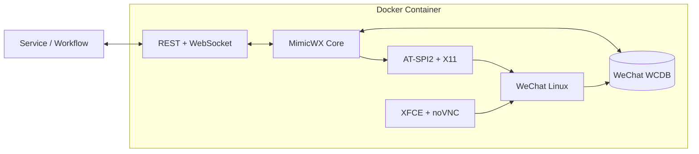

<p align="center">
  
</p>

<p align="center">
  <strong>Turn the WeChat Linux client into a programmable, traceable, bidirectional data channel.</strong>
</p>

<p align="center">
  <a href="README.md">简体中文</a> ·
  <a href="README.en.md">English</a> ·
  <a href="docs/README.md#english">Documentation</a> ·
  <a href="docs/API.md">API Reference</a> ·
  <a href="CHANGELOG.md">Changelog</a>
</p>

<p align="center">
  <a href="LICENSE"></a>
  
  
  
  <a href="https://github.com/qianshulab/MimicWX-Linux/commits/main"></a>
</p>

MimicWX-Linux runs the official WeChat Linux client in a container and exposes REST and WebSocket interfaces backed by local WCDB parsing, AT-SPI2, and X11 automation. Consumers can receive messages in real time, download attachments, preserve conversation and sender identity, and send text or files back to the correct chat.

> [!IMPORTANT]
> MimicWX-Linux is not an official WeChat API and is not affiliated with or endorsed by Tencent or the WeChat team. It depends on implementation details of the WeChat Linux client that may change without notice. Use it only with authorized accounts and data, and comply with applicable law, privacy requirements, and platform rules.

## Why MimicWX-Linux

| Requirement | Capability |
| --- | --- |
| Reliable ingestion | Real-time WebSocket events, independent consumer cursors, database history catch-up, and stable message IDs |
| Correct routing | Explicit conversation, group, and actual-sender identity without relying on mutable display names |
| File round trip | Authenticated downloads for documents, archives, APKs, executables, and outbound file sending |
| Bidirectional messaging | Send by conversation or reply by message ID, with optional group-sender mention |
| Automatic decryption | WeChat 4.0 memory-scan compatibility plus WeChat 4.1 capture, per-database derivation, HMAC validation, and rotation handling |
| Isolated deployment | WeChat, a virtual desktop, noVNC, and the bridge service contained in one Docker stack |

Typical uses include message archiving, knowledge ingestion, workflow automation, notifications and acknowledgements, bot adapters, and internal systems that use WeChat as an input or output channel.

## Key capabilities

### Messages and identity

- Parses common message types including text, image, audio, video, file, contact card, location, link, and mini-program messages.
- Exposes stable `message_id`, `conversation_id`, `sender_id`, `direction`, and `is_group` fields.
- Uses one identity model for private and group chats while preserving the actual group member.
- Supports time-and-offset history pagination and per-consumer real-time cursors.

### Attachments and outbound delivery

- Streams authenticated attachments with single-range HTTP resume support.
- Keeps server paths out of attachment IDs and confines resolution to approved account directories.
- Sends text, images, and Base64-encoded files; an outbound file is limited to 100 MiB.
- Replies by recent message ID and can mention the originating member in a group chat.

### Runtime resilience

- Reconnects to AT-SPI2, rebuilds stale UI nodes, and verifies sends against the database.
- Captures WeChat 4.1 passphrases, derives per-database keys, and validates page-1 HMACs.
- Discovers new databases and atomically reloads key maps and database connections.
- Includes Compose health checks, log rotation, persistent data directories, and a Docker secret for VNC.

## Architecture



The receive path follows database changes. The send path uses the WeChat client and verifies the resulting database event. UI automation is not the primary message-reading mechanism, which reduces receive-path sensitivity to UI layout changes.

## Quick start

### Requirements

- x86-64 Linux host
- Docker Engine 24+ and Docker Compose v2
- At least 2 GB of free memory and 5 GB of free disk space
- A runtime that permits the `SYS_ADMIN` and `SYS_PTRACE` capabilities

> [!NOTE]
> The image installs the official WeChat x86-64 package. ARM hosts are not currently supported.

### 1. Clone

```bash
git clone https://github.com/qianshulab/MimicWX-Linux.git
cd MimicWX-Linux
```

### 2. Create runtime configuration

```bash
cp .env.example .env
cp config.toml config.local.toml
install -d -m 700 secrets data/xwechat data/xwechat_files
openssl rand -hex 4 > secrets/vnc_password.txt
chmod 600 .env config.local.toml secrets/vnc_password.txt
```

Generate a token and place it in `[api].token` in `config.local.toml`:

```bash
openssl rand -hex 32
```

The default bind address is `127.0.0.1`. Set `MIMICWX_BIND_IP` in `.env` to a specific private-network address only when direct LAN access is required.

### 3. Start

```bash
docker compose up -d --build
docker compose ps
```

### 4. Sign in and verify readiness

Open the following URL, connect with the password in `secrets/vnc_password.txt`, and sign in to WeChat inside the virtual desktop:

```text
http://HOST:6080/vnc.html?autoconnect=true&resize=scale
```

Check readiness:

```bash
curl --fail http://HOST:8899/status
```

Database-backed APIs are ready when the account is logged in and `db_available` is `true`.

The default build uses dependency mirrors suited to networks in mainland China. Set `MIMICWX_USE_MIRROR=0` in `.env` to use upstream sources. Configure required HTTP proxies at the Docker service layer rather than embedding proxy credentials in an image or repository.

See the [Docker deployment guide](docs/DEPLOYMENT.md) for proxy, upgrade, backup, hardening, and troubleshooting details.

## API at a glance

All endpoints except `GET /status` require a Bearer Token:

```http
Authorization: Bearer YOUR_API_TOKEN
```

| Method | Path | Purpose |
| --- | --- | --- |
| `GET` | `/status` | Login, database, and runtime status |
| `GET` | `/contacts` | Contact list |
| `GET` | `/sessions` | Current conversations |
| `GET` | `/messages` | Read the real-time buffer with an independent cursor |
| `GET` | `/messages/history` | Catch up from the decrypted database |
| `GET` | `/attachments/{id}` | Download an attachment with Range support |
| `POST` | `/messages/send` | Send text to a conversation |
| `POST` | `/messages/reply` | Reply using a recent message ID |
| `POST` | `/messages/send-file` | Send a file to a conversation |
| `GET` | `/ws` | Real-time WebSocket stream |

Example text send:

```bash
curl --fail -X POST http://HOST:8899/messages/send \
  -H "Authorization: Bearer YOUR_API_TOKEN" \
  -H "Content-Type: application/json" \
  -d '{"conversation":"File Transfer","text":"Hello from MimicWX","at":[]}'
```

Production consumers should durably deduplicate by `message_id` and use `/messages/history` to catch up after a WebSocket reconnect. See the complete [API reference](docs/API.md).

## Identity and delivery model

Display names can change or collide. New integrations should use stable IDs for routing, storage, and deduplication.

| Field | Meaning | Recommended use |
| --- | --- | --- |
| `message_id` | Stable message identifier | Idempotency, deduplication, and reply lookup |
| `conversation_id` | Private contact or group identifier | Reply target and stream partition |
| `sender_id` | Actual sender; a member ID in a group | User ownership and group-member identity |
| `direction` | `incoming`, `outgoing`, or `system` | Prevent consumers from processing their own replies |
| `create_time` | Unix timestamp in seconds | History checkpoint |
| `attachment` | Attachment locator and availability | Download, validation, and asynchronous processing |

Delivery is at least once: replay is safe, but exactly-once business processing is not guaranteed. Consumers must persist processed message IDs, processing state, and history checkpoints.

## Documentation

| Resource | English | 中文 |
| --- | --- | --- |
| Documentation hub | [docs/README.md](docs/README.md#english) | [文档中心](docs/README.md) |
| API reference | [API.md](docs/API.md) | [API.zh-CN.md](docs/API.zh-CN.md) |
| Docker deployment | [DEPLOYMENT.md](docs/DEPLOYMENT.md) | [DEPLOYMENT.zh-CN.md](docs/DEPLOYMENT.zh-CN.md) |
| Contributing | [CONTRIBUTING.md](CONTRIBUTING.md) | Same document |
| Security policy | [SECURITY.md](SECURITY.md) | Same document |
| Changelog | [CHANGELOG.md](CHANGELOG.md) | Same document |

## Security boundaries

- Do not expose noVNC or the API directly to the public Internet. Prefer an authenticated TLS reverse proxy or SSH tunnel.
- The container requires `SYS_ADMIN` and `SYS_PTRACE`; run it only on a trusted, isolated host.
- Treat documents, archives, APKs, executables, and every other attachment as untrusted input. Apply size limits, content detection, malware scanning, and sandboxed parsing downstream.
- Key material remains in the persistent WeChat data directory and is not written to the image or repository.
- After upgrading WeChat or the container image, validate login, database access, receive, download, and send flows in a rollback-capable environment.

Report vulnerabilities privately according to [SECURITY.md](SECURITY.md). Never publish keys, databases, tokens, contact data, or message contents in an issue.

## Project origin and maintenance

This repository is an independently maintained derivative of [aisuyi065/MimicWX-Linux](https://github.com/aisuyi065/MimicWX-Linux). It preserves the original MIT license and copyright notice. Current maintenance focuses on reliable consumption, identity, attachment transfer, bidirectional delivery, database-key lifecycle management, and standardized container deployment.

WeChat internals and database formats are not stable public interfaces. Compatibility reports should include the MimicWX version, WeChat Linux version, Docker version, sanitized `/status` output, and relevant sanitized logs.

## Contributing

Bug fixes, compatibility improvements, documentation updates, and verifiable new capabilities are welcome. Read [CONTRIBUTING.md](CONTRIBUTING.md) before opening a pull request. Report security issues through the private channel described in the security policy.

## Acknowledgements

- [wxauto](https://github.com/cluic/wxauto) for the independent chat-window management concept
- `wcdb-key-tool` for the WeChat 4.1 database-key derivation compatibility implementation; the pinned source and MIT license are in `vendor/wcdb-key-tool/`

## License

MimicWX-Linux is available under the [MIT License](LICENSE). The derivative retains the original project's copyright notice and separately identifies later modifications.
