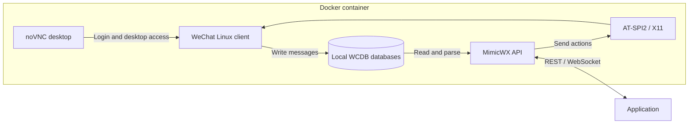

<p align="center">
  
</p>

<p align="center">
  <strong>A self-hosted WeChat message and file bridge with REST and WebSocket APIs.</strong>
</p>

<p align="center">
  <a href="README.md">简体中文</a> ·
  <a href="README.en.md">English</a> ·
  <a href="docs/DEPLOYMENT.md">Deployment</a> ·
  <a href="docs/API.md">API reference</a> ·
  <a href="CHANGELOG.md">Changelog</a>
</p>

<p align="center">
  <a href="LICENSE"></a>
  <a href="CHANGELOG.md"></a>
  
  
</p>

MimicWX-Linux connects the WeChat Linux client to message archives, knowledge bases, and automation applications. Applications can receive messages, identify conversations and senders, download files, and send text or files to a conversation.

The service is written in Rust. It reads messages from local WCDB databases and operates the WeChat client through AT-SPI2 and X11. The Docker Compose deployment includes WeChat, a virtual desktop, noVNC, and the API service.

> [!NOTE]
> This is an unofficial implementation with no affiliation to Tencent or the WeChat team. Compatibility depends on the WeChat Linux client's UI and database formats.

[Features](#features) · [Quick start](#quick-start) · [API usage](#api-usage) · [How it works](#how-it-works) · [Compatibility and limitations](#compatibility-and-limitations)

## Features

- **Message access**: WebSocket events, cursor-based queries, and local history queries by conversation and time.
- **Sender identity**: `message_id`, `conversation_id`, and `sender_id` distinguish messages, private chats, groups, and group members.
- **Structured content**: Fields for text, links, official-account article shares, files, images, audio, video, contact cards, locations, and mini-programs. Parsing media metadata does not imply support for downloading the media file.
- **File transfer**: Download files already saved locally by WeChat, with single-range HTTP support; send Base64-encoded files to a conversation.
- **Outbound messages**: Send text by conversation or reply using a message ID in the live buffer, with an optional mention of the sender in a group.
- **Database keys**: WeChat 4.0 memory scanning and 4.1 login capture paths, with per-database derivation, HMAC validation, and key-map updates.
- **Process recovery**: Container restarts, critical-process monitoring, API health checks, log rotation, and persistent WeChat data.

## Quick start

### Requirements

- An x86-64 Linux host, Docker Engine (24 or later recommended), and Docker Compose v2.
- A container runtime that permits `SYS_ADMIN`, `SYS_PTRACE`, and the security options in the Compose file.
- Access to the WeChat installer, Ubuntu repositories, Rust toolchain, and dependency registry.

Plan for at least 2 GB of available memory and 5 GB of disk space for the running service, plus capacity for databases and attachments. Source builds need additional resources; these figures are planning estimates, not load-tested minimums. The Dockerfile uses the official WeChat x86-64 package and does not provide a native ARM image.

### 1. Clone and configure

For a new deployment:

```bash
git clone https://github.com/qianshulab/MimicWX-Linux.git
cd MimicWX-Linux

cp .env.example .env
cp config.toml config.local.toml
install -d -m 700 secrets data/xwechat data/xwechat_files
openssl rand -hex 4 > secrets/vnc_password.txt
chmod 600 .env config.local.toml secrets/vnc_password.txt
```

Generate an API token:

```bash
openssl rand -hex 32
```

Place the generated value in the `[api]` section of `config.local.toml`:

```toml
[api]
token = "YOUR_RANDOM_API_TOKEN"
```

An empty token disables API authentication. The VNC password and API token are separate credentials.

Ports bind to `127.0.0.1` by default. Use an SSH tunnel for remote access, or set `MIMICWX_BIND_IP` in `.env` to the host's LAN address for direct access from a trusted network. See [network configuration](docs/DEPLOYMENT.md#4-network-configuration).

### 2. Build and start

```bash
docker compose up -d --build
docker compose ps
```

The image is built from this repository. Dependency mirrors for networks in mainland China are enabled by default. Set `MIMICWX_USE_MIRROR=0` in `.env` to use upstream sources. See the [deployment guide](docs/DEPLOYMENT.md) for proxy configuration.

### 3. Sign in to WeChat

Open noVNC, connect with the password in `secrets/vnc_password.txt`, and scan the QR code or confirm the login on your phone:

```text
http://HOST:6080/vnc.html?autoconnect=true&resize=scale
```

Replace `HOST` with the deployment host's address. Use `127.0.0.1` for local access or an SSH tunnel.

Query the service status:

```bash
curl --fail http://HOST:8899/status
```

Before consuming messages, check that `status` is `"已登录"` and `db_available` is `true`. HTTP 200 or a `healthy` container only confirms that the status endpoint responds; it does not confirm a WeChat login.

With Docker configured to start on boot, `restart: always` starts the container after a host reboot. If WeChat requests a new login, complete it through noVNC; background key extraction and database initialization continue after login. See the [deployment guide](docs/DEPLOYMENT.md) for maintenance commands and troubleshooting.

## API usage

With a nonempty API token configured, every endpoint except `GET /status` requires authentication:

```http
Authorization: Bearer YOUR_API_TOKEN
```

| Method | Path | Purpose |
| --- | --- | --- |
| `GET` | `/status` | Login, database, and process status |
| `GET` | `/contacts`, `/sessions` | Contacts and conversations |
| `GET` | `/messages` | Query the live buffer by cursor, conversation, sender, and direction |
| `GET` | `/messages/history` | Query local database history by time and offset |
| `GET` | `/attachments/{id}` | Download a locally available file attachment |
| `POST` | `/messages/send` | Send text to a conversation |
| `POST` | `/messages/reply` | Reply using a buffered message ID |
| `POST` | `/messages/send-file` | Send a file to a conversation |
| `GET` | `/ws` | Subscribe to WebSocket events |

Receive messages:

```bash
curl --fail \
  -H "Authorization: Bearer YOUR_API_TOKEN" \
  "http://HOST:8899/messages?after=0&limit=100&direction=incoming"
```

Within the same service run, save `next_cursor` from the response and pass it as `after` in the next request. Each consumer stores its own cursor; queries do not remove messages from other consumers.

Send text:

```bash
curl --fail -X POST http://HOST:8899/messages/send \
  -H "Authorization: Bearer YOUR_API_TOKEN" \
  -H "Content-Type: application/json" \
  -d '{"conversation":"文件传输助手","text":"Hello from MimicWX","at":[]}'
```

`conversation` accepts a conversation ID or name. The example uses File Transfer Assistant as displayed in the container's Chinese-language client. Check `sent`, `verified`, and `message` in the response; HTTP success is not a delivery or read receipt.

See the [API reference](docs/API.md) for request parameters, response fields, attachments, and reconnect recovery.

### Conversations and senders

| Field | Meaning | Typical use |
| --- | --- | --- |
| `message_id` | Message identifier | Deduplication, processing records, buffered reply lookup |
| `conversation_id` | The private chat or group containing the message | Archive partition and reply target |
| `sender_id` | Actual sender; a member in a group | User and group-member identity |
| `direction` | `incoming`, `outgoing`, or `system` | Distinguish received, outgoing, and system messages |
| `create_time` | Unix timestamp in seconds | History checkpoint |
| `attachment` | File locator, name, size, and availability | File download |

For a group message, `conversation_id` identifies the group and `sender_id` identifies the member. Store both so that a reply is routed to the conversation rather than to the member's private chat.

## How it works


```mermaid
flowchart LR
    subgraph Container["Docker container"]
        WX["WeChat Linux client"]
        DB[("Local WCDB databases")]
        Core["MimicWX API"]
        Input["AT-SPI2 / X11"]
        VNC["noVNC desktop"]
        WX -->|Write messages| DB
        DB -->|Read and parse| Core
        Core -->|Send actions| Input --> WX
        VNC -->|Login and desktop access| WX
    end
    Core <-->|REST / WebSocket| App["Application"]
```

In database mode, the service reads local message changes for queries and events. Outbound operations use the WeChat UI and return send and verification results. noVNC provides login and desktop access; applications use HTTP or WebSocket.

## Compatibility and limitations

- **Client versions**: The 4.0 and 4.1 extraction paths do not imply compatibility with every release in those series. The Dockerfile downloads the official installer, so rebuilding may introduce a different WeChat version.
- **Live buffer**: `/messages` retains the most recent 4096 events. The buffer and cursors reset when the process restarts. There is no durable message queue or consumer acknowledgement protocol, and no at-least-once delivery guarantee. Consumers must deduplicate by `message_id` and recover through history queries while the records remain in the local database.
- **Attachments**: The file endpoint serves local files; it does not trigger a WeChat download or fetch from the CDN. `available=false` can mean a file has not been downloaded, was deleted, or could not be matched. Documents, ZIPs, APKs, executables, and other files are transferred as bytes and are not executed.
- **Upload size**: The default JSON body limit is 2 MiB, including Base64 and other fields, so a file must be slightly smaller than 1.5 MiB. The handler's 100 MiB check is not the effective upload limit in the default deployment.
- **Replies and routing**: Message-ID replies require the original message to remain in the live buffer and do not create a native WeChat quoted-reply card. Outbound operations select chats by display name, so duplicate names still require distinct remarks or chat names.
- **Deployment**: Compose includes `SYS_ADMIN`, `SYS_PTRACE`, and `unconfined` security options. Restrict API and noVNC access to trusted networks or a protected entry point, and handle runtime data as sensitive information.

## Documentation and support

| Document | Contents |
| --- | --- |
| [Deployment guide](docs/DEPLOYMENT.md) | Configuration, networking, proxies, persistence, upgrades, and troubleshooting |
| [API reference](docs/API.md) | Message model, queries, events, attachments, and sending |
| [Documentation index](docs/README.md) | English and Chinese documentation |
| [Changelog](CHANGELOG.md) | Version changes |
| [Contributing](CONTRIBUTING.md) | Development setup and contribution workflow |
| [Security policy](SECURITY.md) | Vulnerability reporting and data-handling requirements |

Report bugs and compatibility issues in [Issues](https://github.com/qianshulab/MimicWX-Linux/issues), with the project version, WeChat Linux version, reproduction steps, and sanitized logs. Follow the [security policy](SECURITY.md) for vulnerabilities.

## Origin and license

MimicWX-Linux is an independently maintained derivative of [aisuyi065/MimicWX-Linux](https://github.com/aisuyi065/MimicWX-Linux), distributed under the [MIT License](LICENSE) with the original copyright notice retained.

- [wxauto](https://github.com/cluic/wxauto): the independent chat-window management concept.
- `wcdb-key-tool`: WeChat 4.1 database-key derivation; see [vendor/wcdb-key-tool](vendor/wcdb-key-tool/) for source and license.
