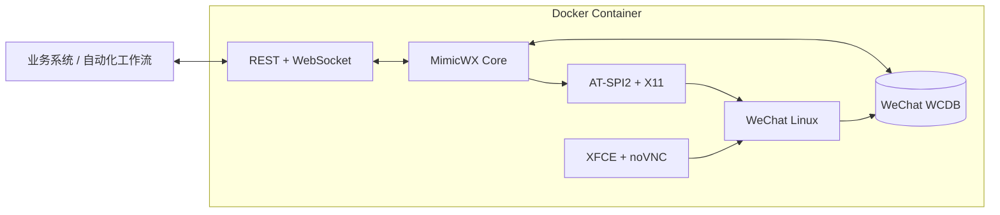

<p align="center">
  
</p>

<p align="center">
  <strong>把微信 Linux 客户端转换为可编程、可追踪、可双向通信的数据通道。</strong>
</p>

<p align="center">
  <a href="README.md">简体中文</a> ·
  <a href="README.en.md">English</a> ·
  <a href="docs/README.md">文档中心</a> ·
  <a href="docs/API.zh-CN.md">API 参考</a> ·
  <a href="CHANGELOG.md">更新日志</a>
</p>

<p align="center">
  <a href="LICENSE"></a>
  
  
  
  <a href="https://github.com/qianshulab/MimicWX-Linux/commits/main"></a>
</p>

MimicWX-Linux 在容器中运行官方微信 Linux 客户端，通过 WCDB 本地数据库解析、AT-SPI2 与 X11 自动化能力，对外提供 REST 和 WebSocket 接口。调用方可以实时接收消息、下载附件、识别会话与实际发送者，并把文本或文件回复到对应聊天。

> [!IMPORTANT]
> MimicWX-Linux 不是微信官方 API，也不隶属于腾讯或微信团队。项目依赖微信 Linux 客户端的界面和本地数据格式，客户端升级可能影响兼容性。请仅处理已获授权的账号和数据，并遵守适用法律、隐私要求与平台规则。

## 为什么选择 MimicWX-Linux

| 目标 | 提供的能力 |
| --- | --- |
| 可靠接收 | WebSocket 实时推送、独立消费游标、数据库历史补拉与稳定消息 ID |
| 正确路由 | 明确区分会话、群聊和实际发送者，避免依赖可能重复或变化的显示名 |
| 文件闭环 | 接收并下载文档、压缩包、APK、EXE 等附件，也可向指定会话发送文件 |
| 双向交互 | 按会话发送文本，或按消息 ID 回复；群聊可自动提及原发送者 |
| 自动解密 | 兼容微信 4.0 内存扫描，支持微信 4.1 登录捕获、逐库派生、HMAC 校验与轮换更新 |
| 隔离部署 | 微信、虚拟桌面、noVNC 和服务端集中在容器中，运行数据与镜像分离 |

典型用途包括消息归档、知识库采集、自动化工作流、通知与回执、机器人适配器，以及需要以微信作为数据入口或输出通道的内部系统。

## 功能概览

### 消息与身份

- 解析文本、图片、语音、视频、文件、名片、位置、链接和小程序等常见消息类型。
- 每条消息提供稳定 `message_id`、`conversation_id`、`sender_id`、`direction` 与 `is_group`。
- 私聊和群聊使用同一套消息模型；群消息保留具体成员身份。
- 历史接口按时间与偏移分页，实时接口为每个调用方维护独立游标。

### 附件与发送

- 附件通过受认证接口流式下载，支持单段 HTTP Range 断点续传。
- 附件 ID 不暴露宿主机路径，并限制在当前账号的允许目录中解析。
- 支持向会话发送文本、图片和 Base64 文件；单个发送文件最大 100 MiB。
- 支持按实时消息 ID 回复原会话，并在群聊中提及原发送者。

### 运行与恢复

- AT-SPI2 总线重连、失效节点重建和发送结果数据库验证。
- 微信 4.1 口令监听、数据库密钥逐库派生及 page-1 HMAC 验证。
- 新数据库发现、密钥映射原子更新与连接热重建。
- Compose 健康检查、日志轮转、持久化目录和 Docker secret。

## 架构



接收链路以本地数据库增量为准，发送链路通过微信客户端完成并在数据库侧验证。界面自动化不承担主要消息读取职责，降低界面结构变化对接收链路的影响。

## 快速开始

### 前置条件

- x86-64 Linux 主机
- Docker Engine 24+ 与 Docker Compose v2
- 至少 2 GB 可用内存和 5 GB 可用磁盘空间
- 容器运行时允许 `SYS_ADMIN` 与 `SYS_PTRACE` capability

> [!NOTE]
> 当前镜像安装微信官方 x86-64 软件包，ARM 主机不能直接运行。

### 1. 获取项目

```bash
git clone https://github.com/qianshulab/MimicWX-Linux.git
cd MimicWX-Linux
```

### 2. 创建运行配置

```bash
cp .env.example .env
cp config.toml config.local.toml
install -d -m 700 secrets data/xwechat data/xwechat_files
openssl rand -hex 4 > secrets/vnc_password.txt
chmod 600 .env config.local.toml secrets/vnc_password.txt
```

生成 API Token，并写入 `config.local.toml` 的 `[api].token`：

```bash
openssl rand -hex 32
```

默认只监听 `127.0.0.1`。如需从可信局域网直接访问，将 `.env` 中的 `MIMICWX_BIND_IP` 改为主机的局域网地址。

### 3. 启动

```bash
docker compose up -d --build
docker compose ps
```

### 4. 登录与检查

打开以下地址，用 `secrets/vnc_password.txt` 中的密码连接，然后在虚拟桌面内扫码登录微信：

```text
http://HOST:6080/vnc.html?autoconnect=true&resize=scale
```

检查服务状态：

```bash
curl --fail http://HOST:8899/status
```

当账号已登录且 `db_available` 为 `true` 时，数据库消息接口可以开始工作。

> 国内网络默认使用构建镜像源。其他网络环境可在 `.env` 中设置 `MIMICWX_USE_MIRROR=0`。需要 HTTP 代理时，建议在 Docker 服务层配置，避免把代理凭据写入镜像或仓库。

完整安装、代理、升级、备份与故障排查说明见 [Docker 部署指南](docs/DEPLOYMENT.zh-CN.md)。

## API 快览

除 `GET /status` 外，接口使用 Bearer Token：

```http
Authorization: Bearer YOUR_API_TOKEN
```

| 方法 | 路径 | 用途 |
| --- | --- | --- |
| `GET` | `/status` | 登录、数据库和运行状态 |
| `GET` | `/contacts` | 联系人列表 |
| `GET` | `/sessions` | 当前会话列表 |
| `GET` | `/messages` | 按独立游标读取实时消息缓存 |
| `GET` | `/messages/history` | 从数据库补拉历史消息 |
| `GET` | `/attachments/{id}` | 下载附件，支持 Range 请求 |
| `POST` | `/messages/send` | 向指定会话发送文本 |
| `POST` | `/messages/reply` | 按消息 ID 回复原会话 |
| `POST` | `/messages/send-file` | 向指定会话发送文件 |
| `GET` | `/ws` | WebSocket 实时消息流 |

发送文本示例：

```bash
curl --fail -X POST http://HOST:8899/messages/send \
  -H "Authorization: Bearer YOUR_API_TOKEN" \
  -H "Content-Type: application/json" \
  -d '{"conversation":"文件传输助手","text":"Hello from MimicWX","at":[]}'
```

生产消费方应持久化 `message_id` 去重，并在 WebSocket 重连后通过 `/messages/history` 补拉中断期间的消息。完整协议见 [中文 API 参考](docs/API.zh-CN.md)。

## 消息身份模型

显示名称会变化，也可能重复。新接入应使用稳定 ID 完成去重、归档和消息路由。

| 字段 | 语义 | 推荐用途 |
| --- | --- | --- |
| `message_id` | 稳定消息标识 | 幂等、去重、按消息回复 |
| `conversation_id` | 私聊联系人或群聊 ID | 回复目标与会话分区 |
| `sender_id` | 实际发送者；群聊中为成员 ID | 用户归属与群成员识别 |
| `direction` | `incoming`、`outgoing` 或 `system` | 防止重复消费自身回复 |
| `create_time` | Unix 秒级时间 | 历史补拉水位 |
| `attachment` | 附件定位与可用状态 | 下载、校验与异步处理 |

接口采用至少一次投递语义：允许安全重放，不保证业务侧恰好一次处理。调用方需要持久化消息 ID、处理状态和历史检查点。

## 配置与数据

| 项目 | 默认值或位置 | 说明 |
| --- | --- | --- |
| API Token | `config.local.toml` | 生产环境必须设置长随机值 |
| 主机绑定地址 | `MIMICWX_BIND_IP=127.0.0.1` | API 与 noVNC 的监听地址 |
| 镜像标签 | `MIMICWX_IMAGE=local/mimicwx-linux:0.6.0` | 建议升级时使用不可变标签 |
| 微信数据 | `data/xwechat/` | 包含账号数据、数据库和密钥映射 |
| 微信文件 | `data/xwechat_files/` | 文件接收与缓存目录 |
| VNC 密码源 | `secrets/vnc_password.txt` | 权限应保持为 `0600` |

这些运行文件均已从 Git 排除。备份必须按敏感数据保护，不应上传数据库、密钥、Token、联系人信息或聊天内容。

## 文档

| 文档 | 中文 | English |
| --- | --- | --- |
| 文档入口 | [文档中心](docs/README.md) | [Documentation hub](docs/README.md#english) |
| API 参考 | [API.zh-CN.md](docs/API.zh-CN.md) | [API.md](docs/API.md) |
| Docker 部署 | [DEPLOYMENT.zh-CN.md](docs/DEPLOYMENT.zh-CN.md) | [DEPLOYMENT.md](docs/DEPLOYMENT.md) |
| 贡献指南 | [CONTRIBUTING.md](CONTRIBUTING.md) | 同一文档含英文摘要 |
| 安全策略 | [SECURITY.md](SECURITY.md) | Same document |
| 版本记录 | [CHANGELOG.md](CHANGELOG.md) | Same document |

## 安全边界

- 不要把 noVNC 或 API 直接暴露到公网；优先使用受认证的 TLS 反向代理或 SSH 隧道。
- 容器需要 `SYS_ADMIN` 和 `SYS_PTRACE`，只应运行在可信且隔离的主机上。
- 文档、压缩包、APK、EXE 等附件均属于不可信输入；下游应执行大小限制、真实类型识别、恶意文件扫描和沙箱解析。
- 密钥材料只保存在持久化微信数据目录，不写入镜像或版本库。
- 升级微信客户端或镜像后，应在可回滚环境中验证登录、数据库、接收、下载和发送链路。

安全问题请按照 [安全策略](SECURITY.md) 私下报告，不要在公开 Issue 中提交密钥、数据库或聊天数据。

## 项目来源与维护

本仓库是基于 [aisuyi065/MimicWX-Linux](https://github.com/aisuyi065/MimicWX-Linux) 的独立维护衍生版本，保留原项目的 MIT 许可证与版权声明。当前版本重点维护可靠消息消费、身份模型、附件传输、双向发送、数据库密钥生命周期与标准化容器部署。

微信客户端内部实现和数据库格式不属于稳定公共接口。兼容性问题请附带 MimicWX 版本、微信 Linux 版本、Docker 版本、脱敏后的 `/status` 输出和相关日志。

## 参与贡献

欢迎提交缺陷修复、兼容性改进、文档完善和可验证的新能力。开始前请阅读 [贡献指南](CONTRIBUTING.md)，安全漏洞请使用私密报告渠道。

## 致谢

- [wxauto](https://github.com/cluic/wxauto)：独立聊天窗口管理思路
- `wcdb-key-tool`：微信 4.1 数据库密钥派生兼容实现，固定版本与 MIT 许可证见 `vendor/wcdb-key-tool/`

## License

MimicWX-Linux 使用 [MIT License](LICENSE)。衍生版本保留原项目版权声明，并对后续修改单独标注版权。
