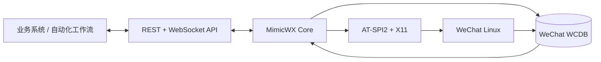

# MimicWX-Linux

Linux 环境下的微信消息与文件双向桥接服务。

[](LICENSE)
[](Cargo.toml)
[](docker-compose.yml)

MimicWX-Linux 在容器中运行官方微信 Linux 客户端，通过本地数据库解析、AT-SPI2 与 X11 自动化能力，对外提供 REST 和 WebSocket 接口。业务系统可实时接收消息、下载附件、识别会话与实际发送者，并将文本或文件回复到对应聊天。

> [!IMPORTANT]
> 本项目不是微信官方 API。它依赖微信 Linux 客户端的界面和本地数据格式，客户端升级可能影响兼容性。请仅处理已获授权的账号和数据，并自行遵守适用法律、隐私要求与平台规则。

## 核心能力

| 能力 | 说明 |
| --- | --- |
| 实时消息 | WebSocket 推送与多客户端独立游标，支持断线后的历史补拉 |
| 会话身份 | 提供稳定 `message_id`、`conversation_id`、`sender_id`、消息方向和群聊标记 |
| 结构化解析 | 支持文本、图片、语音、视频、文件、名片、位置、链接、小程序等常见消息类型 |
| 附件交付 | 受认证的流式下载与 Range 断点续传；文档、压缩包、APK、EXE 等均按原始字节交付 |
| 消息发送 | 按会话发送文本或文件，也可按消息 ID 回复；群聊回复可自动提及原发送者 |
| 密钥生命周期 | 兼容微信 4.0 内存扫描；支持微信 4.1 登录口令捕获、逐库密钥派生、HMAC 校验与轮换热更新 |
| 容器化运行 | 集成微信、XFCE、TigerVNC、noVNC 与 MimicWX 服务，持久化数据与程序镜像分离 |
| 接口保护 | Bearer Token 认证、附件路径约束、上传大小限制和容器日志轮转 |

## 工作方式



- 接收路径：微信写入本地 WCDB，MimicWX 监听增量并解析为统一消息模型。
- 发送路径：调用方提交会话、文本或文件，MimicWX 通过微信客户端完成发送并进行数据库侧验证。
- 密钥路径：登录时捕获数据库口令，按数据库 salt 派生密钥，通过 page-1 HMAC 验证后启用。

## 快速开始

### 环境要求

- x86-64 Linux 主机
- Docker Engine 24+ 与 Docker Compose v2
- 至少 2 GB 可用内存和 5 GB 可用磁盘空间
- 可访问微信官方下载地址和容器构建依赖源
- 容器运行时允许 `SYS_ADMIN` 与 `SYS_PTRACE` capability

> [!NOTE]
> 当前镜像安装微信官方 x86-64 软件包，不支持 ARM 主机直接运行。

### 1. 准备配置

```bash
git clone https://github.com/qianshulab/MimicWX-Linux.git
cd MimicWX-Linux

cp .env.example .env
cp config.toml config.local.toml
install -d -m 700 secrets data/xwechat data/xwechat_files
openssl rand -hex 4 > secrets/vnc_password.txt
chmod 600 .env config.local.toml secrets/vnc_password.txt
```

编辑 `config.local.toml`，为 API 设置随机且足够长的 Token：

```toml
[api]
token = "replace-with-a-long-random-token"
```

默认只监听 `127.0.0.1`。需要从可信局域网访问时，将 `.env` 中的 `MIMICWX_BIND_IP` 改为主机的局域网地址；通过反向代理或 SSH 隧道访问时应保持默认值。

### 2. 启动服务

```bash
docker compose up -d --build
docker compose ps
```

国内网络默认使用镜像源构建。其他网络环境可在 `docker-compose.yml` 中将 `USE_MIRROR` 改为 `0`，或在 Docker 服务层配置代理。不要把代理凭据写入镜像或提交到仓库。

### 3. 登录微信

打开 `http://HOST:6080/vnc.html?autoconnect=true&resize=scale`，输入 `secrets/vnc_password.txt` 中的密码，然后在虚拟桌面内扫码登录微信。

登录后可检查服务状态：

```bash
curl --fail http://HOST:8899/status
```

当 `status` 表示已登录且 `db_available` 为 `true` 时，消息数据库与接口已可用。

## API 概览

除 `GET /status` 外，接口默认使用 Bearer Token：

```http
Authorization: Bearer YOUR_API_TOKEN
```

| 方法 | 路径 | 用途 |
| --- | --- | --- |
| `GET` | `/status` | 登录状态、数据库状态与运行信息 |
| `GET` | `/contacts` | 联系人列表 |
| `GET` | `/sessions` | 当前会话列表 |
| `GET` | `/messages` | 按独立游标读取实时消息缓存 |
| `GET` | `/messages/history` | 从已解密数据库补拉历史消息 |
| `GET` | `/attachments/{id}` | 下载附件，支持 Range 请求 |
| `POST` | `/messages/send` | 向指定会话发送文本 |
| `POST` | `/messages/reply` | 按消息 ID 回复原会话 |
| `POST` | `/messages/send-file` | 向指定会话发送文件 |
| `GET` | `/ws` | WebSocket 实时消息流 |

### 接收实时消息

```javascript
const ws = new WebSocket("ws://HOST:8899/ws?token=YOUR_API_TOKEN")

ws.onmessage = ({ data }) => {
  const event = JSON.parse(data)
  if (event.type === "db_message") {
    console.log(event.message_id, event.conversation_id, event.sender_id)
  }
}
```

生产环境应使用请求头认证、持久化 `message_id` 去重，并在重连后通过 `/messages/history` 补拉中断期间的消息。

### 发送文本

```bash
curl --fail -X POST http://HOST:8899/messages/send \
  -H "Authorization: Bearer YOUR_API_TOKEN" \
  -H "Content-Type: application/json" \
  -d '{"conversation":"文件传输助手","text":"Hello from MimicWX","at":[]}'
```

### 回复指定消息

```bash
curl --fail -X POST http://HOST:8899/messages/reply \
  -H "Authorization: Bearer YOUR_API_TOKEN" \
  -H "Content-Type: application/json" \
  -d '{"message_id":"wx:123456789","text":"处理完成","mention_sender":true}'
```

完整字段、分页规则、附件处理和可靠消费方式请参阅：

- [API 参考（中文）](docs/API.zh-CN.md)
- [API Reference (English)](docs/API.md)

## 消息身份模型

显示名称会变化，也可能重复。新接入应使用稳定 ID 完成去重、归档和消息路由。

| 字段 | 用途 |
| --- | --- |
| `message_id` | 消息去重与按消息回复 |
| `conversation_id` | 回复目标；私聊对应联系人，群聊对应群 |
| `sender_id` | 实际发送者；群聊中对应具体成员 |
| `direction` | `incoming`、`outgoing` 或 `system` |
| `is_group` | 标识当前会话是否为群聊 |
| `attachment` | 可下载附件的名称、大小、状态和地址 |

建议业务侧持久化 `message_id`、`conversation_id`、`sender_id` 和 `create_time`。过滤或单独处理 `direction=outgoing`，可避免自动化程序重复消费自己的回复。

## 配置

运行时配置文件默认为 `config.local.toml`，通过 `.env` 中的 `MIMICWX_CONFIG_FILE` 挂载到容器内。

```toml
[api]
# 留空表示关闭认证，不建议在共享网络中使用
token = "YOUR_API_TOKEN"

[listen]
# 启动后自动打开并监听的联系人或群聊显示名
auto = ["文件传输助手"]

[timing]
# 群聊 @ 操作的界面等待时间，单位为毫秒
at_delay_ms = 300
```

| 环境变量 | 默认值 | 说明 |
| --- | --- | --- |
| `MIMICWX_BIND_IP` | `127.0.0.1` | API 与 noVNC 的宿主机监听地址 |
| `MIMICWX_IMAGE` | `local/mimicwx-linux:0.6.0` | 构建或运行的镜像标签 |
| `MIMICWX_CONFIG_FILE` | `./config.local.toml` | 宿主机运行时配置文件 |

## 数据与密钥

| 路径 | 内容 | 备份建议 |
| --- | --- | --- |
| `data/xwechat/` | 微信账号数据、数据库与派生密钥映射 | 需要，按敏感数据保护 |
| `data/xwechat_files/` | 微信文件目录 | 按业务需要 |
| `config.local.toml` | API Token 与监听配置 | 需要，禁止提交 Git |
| `secrets/vnc_password.txt` | noVNC/VNC 密码来源 | 需要，限制文件权限 |

密钥材料只保存在持久化微信数据目录中，不写入镜像或仓库。微信 4.1 登录期间捕获的口令会按每个数据库的 salt 派生密钥，只有通过 HMAC 校验的结果才会投入使用。新增数据库或口令轮换会触发密钥映射更新与数据库连接重建，无需重启容器。

## 安全建议

- 仅在可信网络中开放 6080 和 8899；不要把 noVNC 或 API 直接暴露到公网。
- 在生产环境使用带 TLS 和访问控制的反向代理，并保持主机端口绑定为 `127.0.0.1`。
- 为 API 和 VNC 分别设置随机凭据，文件权限保持为 `0600`，发现泄露后立即轮换。
- 将文档、压缩包、APK、EXE 等附件视为不可信输入；下载后进行大小限制、类型识别、病毒扫描和隔离解析。
- 容器需要 `SYS_ADMIN` 与 `SYS_PTRACE`。这两项 capability 具有较高权限，只应在可信、隔离的主机上运行。
- 升级前备份持久化目录并保留上一镜像标签，完成登录、接收、附件下载和发送验证后再清理旧版本。

更完整的安装、代理、升级、备份和故障排查说明见 [Docker 部署指南](docs/DEPLOYMENT.md)。

## 项目结构

```text
MimicWX-Linux/
├── src/                    # Rust 核心、数据库解析与 API
├── docker/                 # 容器启动与密钥提取脚本
├── adapter/                # Yunzai-Bot 适配器
├── docs/                   # 部署与 API 文档
├── vendor/wcdb-key-tool/   # 固定版本的兼容工具及许可证
├── Dockerfile
├── docker-compose.yml
└── config.toml
```

## 开发与验证

```bash
cargo fmt --check
cargo test --all-targets
docker compose build
```

问题反馈请附带 MimicWX 版本、微信 Linux 客户端版本、Docker 版本、脱敏后的 `/status` 输出与相关日志。请勿提交微信数据库、密钥、Token、联系人信息或聊天内容。

## 兼容性说明

- 运行平台：x86-64 Linux
- 容器基础：Ubuntu 22.04
- 微信客户端：构建时下载官方 Linux x86-64 软件包
- 密钥提取：微信 4.0 兼容路径；微信 4.1 登录捕获与持续轮换监听

微信客户端内部实现和数据库格式不属于稳定公共接口。升级微信或镜像后，应先在可回滚环境中验证登录、数据库可用性、消息接收、附件下载和消息发送。

## 项目来源与维护

本仓库是基于 [aisuyi065/MimicWX-Linux](https://github.com/aisuyi065/MimicWX-Linux) 的独立维护衍生版本，保留原项目的 MIT 许可证与版权声明。当前版本重点维护可靠消息消费、会话与发送者身份、附件传输、双向发送、数据库密钥生命周期以及标准化容器部署。

本项目与腾讯或微信团队无隶属、授权或背书关系。

## 致谢

- [wxauto](https://github.com/cluic/wxauto)：独立聊天窗口管理思路
- `wcdb-key-tool`：微信 4.1 数据库密钥派生兼容实现，固定版本及 MIT 许可证见 `vendor/wcdb-key-tool/`

## License

[MIT](LICENSE)
