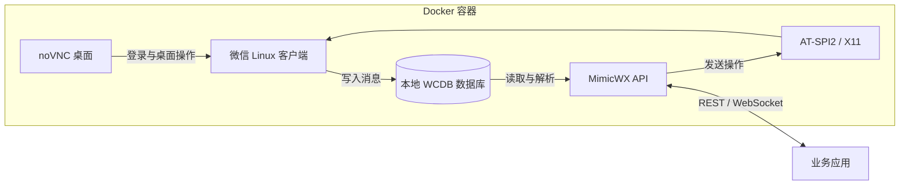

<p align="center">
  
</p>

<p align="center">
  <strong>自托管的微信消息与文件桥接服务，提供 REST API 和 WebSocket 接口。</strong>
</p>

<p align="center">
  <a href="README.md">简体中文</a> ·
  <a href="README.en.md">English</a> ·
  <a href="docs/DEPLOYMENT.zh-CN.md">部署指南</a> ·
  <a href="docs/API.zh-CN.md">API 参考</a> ·
  <a href="CHANGELOG.md">更新日志</a>
</p>

<p align="center">
  <a href="LICENSE"></a>
  <a href="CHANGELOG.md"></a>
  
  
</p>

MimicWX-Linux 将微信 Linux 客户端接入消息归档、知识库和自动化应用。应用可通过接口接收消息、识别会话与发送者、下载文件，并向指定会话发送文本或文件。

服务使用 Rust 编写，通过本地 WCDB 数据库读取消息，通过 AT-SPI2 与 X11 操作微信客户端。Docker Compose 包含微信、虚拟桌面、noVNC 和 API 服务。

> [!NOTE]
> 本项目为非官方实现，与腾讯及微信团队无隶属关系。兼容性取决于微信 Linux 客户端的界面和数据库格式。

[功能](#功能) · [快速开始](#快速开始) · [接口接入](#接口接入) · [工作原理](#工作原理) · [兼容性与限制](#兼容性与限制)

## 功能

- **消息接收**：WebSocket 实时事件、带游标的消息查询，以及按会话和时间查询本地历史记录。
- **身份识别**：消息包含 `message_id`、`conversation_id` 和 `sender_id`，区分私聊联系人、群聊和群成员。
- **内容解析**：提供文本、链接、公众号分享、文件、图片、语音、视频、名片、位置和小程序等消息的结构化字段。媒体元数据解析不等同于媒体文件下载。
- **文件传输**：下载微信已保存到本地的文件，支持单段 HTTP Range；通过接口向会话发送 Base64 编码的文件。
- **消息发送**：按会话发送文本，或按实时缓存中的消息 ID 回复原会话；群聊回复可提及原发送者。
- **密钥管理**：包含微信 4.0 内存扫描和 4.1 登录捕获两条提取路径，支持逐库派生、HMAC 校验和密钥映射更新。
- **运行恢复**：容器自动重启、关键进程监测、API 健康检查、日志轮转和微信数据持久化。

## 快速开始

### 环境要求

- x86-64 Linux 主机、Docker Engine（建议 24 或更高版本）和 Docker Compose v2。
- 容器运行时允许 `SYS_ADMIN`、`SYS_PTRACE`，以及 Compose 中配置的安全选项。
- 可访问微信安装包、Ubuntu 软件源、Rust 工具链和依赖仓库。

建议为运行服务预留至少 2 GB 可用内存和 5 GB 磁盘空间，并另行规划数据库与附件容量。源码构建需要额外内存和磁盘；这些数值不是经过负载测试的资源下限。当前 Dockerfile 使用微信官方 x86-64 安装包，不提供 ARM 原生镜像。

### 1. 下载并配置

以下命令用于首次部署：

```bash
git clone https://github.com/qianshulab/MimicWX-Linux.git
cd MimicWX-Linux

cp .env.example .env
cp config.toml config.local.toml
install -d -m 700 secrets data/xwechat data/xwechat_files
openssl rand -hex 4 > secrets/vnc_password.txt
chmod 600 .env config.local.toml secrets/vnc_password.txt
```

生成 API Token：

```bash
openssl rand -hex 32
```

将生成值填入 `config.local.toml` 的 `[api]` 配置：

```toml
[api]
token = "YOUR_RANDOM_API_TOKEN"
```

Token 留空时不启用 API 认证。VNC 密码与 API Token 相互独立。

默认端口仅绑定 `127.0.0.1`。远程访问可使用 SSH 隧道；需要直接从可信局域网访问时，将 `.env` 中的 `MIMICWX_BIND_IP` 设置为部署主机的局域网地址。具体配置见[网络配置](docs/DEPLOYMENT.zh-CN.md#4-网络配置)。

### 2. 构建并启动

```bash
docker compose up -d --build
docker compose ps
```

镜像从本仓库源码构建。默认使用国内依赖镜像源；使用上游源时，在 `.env` 中设置 `MIMICWX_USE_MIRROR=0`。代理配置见[镜像源与代理](docs/DEPLOYMENT.zh-CN.md#5-镜像源与代理)。

### 3. 登录微信

打开 noVNC，使用 `secrets/vnc_password.txt` 中的密码连接桌面，再扫码或在手机端确认登录：

```text
http://HOST:6080/vnc.html?autoconnect=true&resize=scale
```

`HOST` 为部署主机地址；本机访问或 SSH 隧道访问时使用 `127.0.0.1`。

查询运行状态：

```bash
curl --fail http://HOST:8899/status
```

消息接入前应确认响应中 `status` 为 `"已登录"`，且 `db_available` 为 `true`。HTTP 200 或容器 `healthy` 只代表状态接口可响应，不代表微信已经登录。

Docker 服务随主机启动后，`restart: always` 会自动启动容器。如果微信要求重新登录，需通过 noVNC 完成确认；后台密钥提取与数据库初始化随登录继续执行。操作命令和故障排查见[部署指南](docs/DEPLOYMENT.zh-CN.md)。

## 接口接入

设置非空 API Token 后，除 `GET /status` 外的接口需要认证：

```http
Authorization: Bearer YOUR_API_TOKEN
```

| 方法 | 路径 | 用途 |
| --- | --- | --- |
| `GET` | `/status` | 查询登录、数据库与进程状态 |
| `GET` | `/contacts`、`/sessions` | 查询联系人和会话 |
| `GET` | `/messages` | 按游标查询实时缓存，可筛选会话、发送者和方向 |
| `GET` | `/messages/history` | 按时间和偏移查询本地数据库中的历史消息 |
| `GET` | `/attachments/{id}` | 下载本地可用的文件附件 |
| `POST` | `/messages/send` | 向指定会话发送文本 |
| `POST` | `/messages/reply` | 根据缓存中的消息 ID 回复 |
| `POST` | `/messages/send-file` | 向指定会话发送文件 |
| `GET` | `/ws` | 订阅 WebSocket 事件 |

接收消息：

```bash
curl --fail \
  -H "Authorization: Bearer YOUR_API_TOKEN" \
  "http://HOST:8899/messages?after=0&limit=100&direction=incoming"
```

同一次服务运行期间，调用方保存响应的 `next_cursor`，并在下次请求中作为 `after` 传入。每个调用方独立保存游标，查询不会删除其他调用方可读取的消息。

发送文本：

```bash
curl --fail -X POST http://HOST:8899/messages/send \
  -H "Authorization: Bearer YOUR_API_TOKEN" \
  -H "Content-Type: application/json" \
  -d '{"conversation":"文件传输助手","text":"Hello from MimicWX","at":[]}'
```

`conversation` 支持会话 ID 或名称。发送请求返回后，应检查 `sent`、`verified` 和 `message`；HTTP 成功不等于对方已收到或已读。

完整请求参数、响应字段、附件下载和重连补拉流程见 [API 参考](docs/API.zh-CN.md)。

### 会话与发送者

| 字段 | 含义 | 常见用途 |
| --- | --- | --- |
| `message_id` | 消息标识 | 去重、处理记录、缓存内回复定位 |
| `conversation_id` | 消息所属的私聊或群聊 | 归档分区、回复目标 |
| `sender_id` | 实际发送者；群聊中为成员 | 关联用户与群成员 |
| `direction` | `incoming`、`outgoing` 或 `system` | 区分接收、自发和系统消息 |
| `create_time` | Unix 秒级时间 | 历史查询检查点 |
| `attachment` | 文件定位、名称、大小和可用状态 | 下载文件 |

群消息的 `conversation_id` 指向群，`sender_id` 指向发言成员。应用应保存两者，避免把群成员误作回复会话。

## 工作原理


```mermaid
flowchart LR
    subgraph Container["Docker 容器"]
        WX["微信 Linux 客户端"]
        DB[("本地 WCDB 数据库")]
        Core["MimicWX API"]
        Input["AT-SPI2 / X11"]
        VNC["noVNC 桌面"]
        WX -->|写入消息| DB
        DB -->|读取与解析| Core
        Core -->|发送操作| Input --> WX
        VNC -->|登录与桌面操作| WX
    end
    Core <-->|REST / WebSocket| App["业务应用"]
```

数据库模式下，服务读取本地消息增量并提供查询和推送。发送操作由微信界面执行，返回值包含发送及验证结果。noVNC 用于登录和桌面操作，调用方通过 HTTP 或 WebSocket 访问服务。

## 兼容性与限制

- **客户端兼容性**：项目依赖微信内部实现，4.0 与 4.1 的提取路径不代表支持这两个系列的所有版本。Dockerfile 下载官方安装包，重新构建可能引入新的微信版本。
- **实时缓存**：`/messages` 保存最近 4096 条事件，缓存和游标在进程重启后重置。服务没有持久消息队列或消费确认协议，不能保证至少一次投递。消费方需保存 `message_id` 去重，并通过历史接口补拉本地数据库仍保留的消息。
- **附件可用性**：文件接口返回本地文件，不会触发微信下载或从 CDN 拉取文件。`available=false` 时，文件可能未下载、已删除或无法匹配；Office 文档、ZIP、APK、EXE 等均以字节形式传输，不执行其内容。
- **文件发送大小**：默认 JSON 请求体上限为 2 MiB，包含 Base64 和其他字段，因此实际文件需略小于 1.5 MiB。处理函数中的 100 MiB 校验值不代表默认部署可上传该大小。
- **回复与路由**：按消息 ID 回复仅适用于仍在实时缓存中的消息，且不生成微信原生引用卡片。发送最终通过显示名称选择聊天，同名会话仍需配置可区分的备注或名称。
- **部署边界**：当前 Compose 包含 `SYS_ADMIN`、`SYS_PTRACE` 和 `unconfined` 安全选项。API 与 noVNC 应限制在可信网络或受保护的访问入口，运行数据按敏感信息保管。

## 文档与支持

| 文档 | 内容 |
| --- | --- |
| [部署指南](docs/DEPLOYMENT.zh-CN.md) | 配置、网络、代理、持久化、升级与排障 |
| [API 参考](docs/API.zh-CN.md) | 消息模型、查询、实时事件、附件和发送 |
| [文档索引](docs/README.md) | 中英文文档入口 |
| [更新日志](CHANGELOG.md) | 版本变更 |
| [贡献指南](CONTRIBUTING.md) | 开发环境与贡献流程 |
| [安全策略](SECURITY.md) | 安全问题报告与数据处理要求 |

缺陷和兼容性问题请提交至 [Issues](https://github.com/qianshulab/MimicWX-Linux/issues)，附上项目版本、微信 Linux 版本、复现步骤和脱敏日志。安全问题请按[安全策略](SECURITY.md)报告。

## 项目来源与许可证

本项目基于 [aisuyi065/MimicWX-Linux](https://github.com/aisuyi065/MimicWX-Linux) 独立维护，采用 [MIT License](LICENSE)，保留原项目版权声明。

- [wxauto](https://github.com/cluic/wxauto)：独立聊天窗口管理思路。
- `wcdb-key-tool`：微信 4.1 数据库密钥派生实现，源码与许可证见 [vendor/wcdb-key-tool](vendor/wcdb-key-tool/)。
